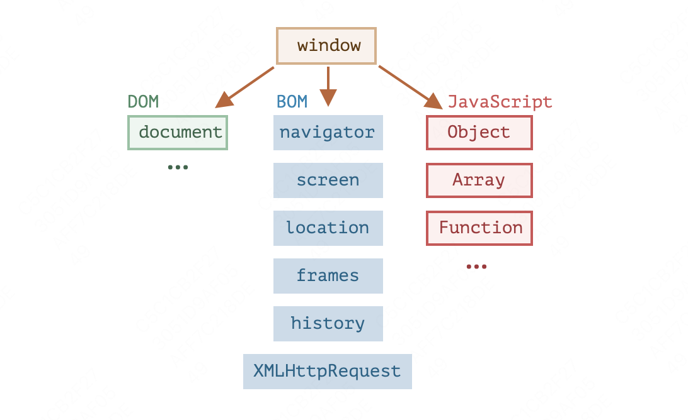

### Browser environment and spec
JavaScript 语言最初是为 Web 浏览器创建的。此后，它已经演变成了一种具有多种用途和平台的语言。

平台可以是一个浏览器，一个 Web 服务器，或其他 主机（host），甚至可以是一个“智能”咖啡机，如果它能运行 JavaScript 的话。它们每个都提供了特定于平台的功能。JavaScript 规范将其称为 主机环境。

主机环境提供了自己的对象和语言核心以外的函数。Web 浏览器提供了一种控制网页的方法。Node.JS 提供了服务器端功能，等等。

下面是 JavaScript 在浏览器中运行时的鸟瞰示意图：


有一个叫做 `window`的“根”对象。它有两个角色：
1. 首先，它是 JavaScript 代码的全局对象。
2. 其次，它代表“浏览器窗口”，并提供了控制它的方法。

#### 文档对象模型（DOM） 
文档对象模型（Document Object Model），简称 DOM，将所有页面内容表示为可以修改的对象。
document 对象是页面的主要“入口点”。我们可以使用它来更改或创建页面上的任何内容。例如：

```js
// 将背景颜色修改为红色
document.body.style.background = "red";

// 在 1 秒后将其修改回来
setTimeout(() => document.body.style.background = "", 1000);
```

在这里，我们使用了 document.body.style，但还有很多很多其他的东西。规范中有属性和方法的详细描述：[DOM Living Standard](https://dom.spec.whatwg.org/)。

>DOM 不仅仅用于浏览器
DOM 规范解释了文档的结构，并提供了操作文档的对象。有的非浏览器设备也使用 DOM。
例如，下载 HTML 文件并对其进行处理的服务器端脚本也可以使用 DOM。但它们可能仅支持部分规范中的内容。

>用于样式的 CSSOM
另外也有一份针对 CSS 规则和样式表的、单独的规范 [CSS Object Model (CSSOM)](https://www.w3.org/TR/cssom-1/)，这份规范解释了如何将 CSS 表示为对象，以及如何读写这些对象。

当我们修改文档的样式规则时，CSSOM 与 DOM 是一起使用的。但实际上，很少需要 CSSOM，因为我们很少需要从 JavaScript 中修改 CSS 规则（我们通常只是添加/移除一些 CSS 类，而不是直接修改其中的 CSS 规则），但这也是可行的。

#### 浏览器对象模型（BOM）
浏览器对象模型（Browser Object Model），简称 BOM，表示由浏览器（主机环境）提供的用于处理文档（document）之外的所有内容的其他对象。

例如：

navigator 对象提供了有关浏览器和操作系统的背景信息。navigator 有许多属性，但是最广为人知的两个属性是：navigator.userAgent —— 关于当前浏览器，navigator.platform —— 关于平台（有助于区分 Windows/Linux/Mac 等）。
location 对象允许我们读取当前 URL，并且可以将浏览器重定向到新的 URL。

#### 总结
说到标准，我们有：

DOM 规范
描述文档的结构、操作和事件，详见 https://dom.spec.whatwg.org。
CSSOM 规范
描述样式表和样式规则，对它们进行的操作，以及它们与文档的绑定，详见 https://www.w3.org/TR/cssom-1/。
HTML 规范
描述 HTML 语言（例如标签）以及 BOM（浏览器对象模型）— 各种浏览器函数：setTimeout，alert，location 等，详见 https://html.spec.whatwg.org。它采用了 DOM 规范，并使用了许多其他属性和方法对其进行了扩展。
此外，某些类被分别描述在 https://spec.whatwg.org/。
