### virtual`DOM`
virtual`DOM`简称（`vNode`），就是一颗以`JavaScript`对象（vNode节点）作为基础的树，用对象属性来描述节点，实际上它
只是一层真实`DOM`的抽象。最终可以通过一系列操作使这棵树映射到真实的`DOM`上。

##### 举个例子
这里是一个真实`DOM`映射到虚拟`DOM`上的例子
```html
<!-- 真实`DOM` -->
<ul id="list">
    <li class="item">1</li>
    <li>2</li>
    <li>3</li>
</ul>
```
```js
// 虚拟`DOM`
{
    tag: 'ul',
    props: {
        id: 'list'
    },
    children: [
        {tag: 'li',props: {class: 'item',},children: [{tag: undefined,text: 1}]},
        {tag: 'li',children: [{tag: undefined,text: 2}]},
        {tag: 'li',children: [{tag: undefined,text: 2}]}
    ]
}
```

### 为何需要虚拟`DOM`
1. 具备跨平台的优势
由于虚拟`DOM`是以`JavaScript`对象为基础而不依赖浏览器的运行环境，所以这使得它具有跨平台的能力，可以运行在浏览器，`node`等环境

2. 原生`DOM`操作慢，而js运行效率高
我们可以将`DOM`放在js层，提高效率
因为`DOM`操作的执行速度远不如`JavaScript`的运算速度快，因此，把大量的`DOM`操作搬到`JavaScript`中，运用`patch`算法来计算真正需要更新的节点，最大限度的减少`DOM`操作，从而显著提高性能。
虚拟`DOM`本质上就是在js和`DOM`中做一个缓存。可以类比`CPU`和硬盘，既然硬盘读取速度慢，我们就在它们之间做一个缓存，同理`DOM`操作慢，我们就在它们`js`和`DOM`之间加一个缓存。`CPU（js）`只操作内存（虚拟`DOM`），最后更新的时候就写入硬盘。

3. 提升渲染性能
虚拟`DOM`的优势不在于单次的操作，而是在大量，频繁的数据更新下，能够对视图进行合理，高效的更新

### ``diff``算法
虚拟`DOM`是纯粹的`js`对象，所以操作它会很高效，虚拟`DOM`最终是会转换成真实的`DOM`。所以为了实现高效的`DOM`操作，一套效率高的虚拟`DOM`算法显得非常有必要。

##### `diff`算法包括以下几个步骤
1. 用js对象结构表示`DOM`树的结构，然后用这个树构建成一个真正的`DOM`树，并插入到文档中
2. 当状态变更的时候，重新构造一颗新的对象树。然后用新的树和旧的树进行对比（`diff`），记录两棵树的差异
3. 把步骤2里面的差异应用到步骤1构建的真正`DOM`树上，这样视图就更新了

`diff`算法是通过同层的树节点进行比较而非对树进行逐层搜索遍历的方式，所以时间复杂度只有`O(n)`，是一种相当高效的算法。


##### `diff`设计原理
>逐个遍历`newVDOM`的节点，找到它在`oldVDOM`中的位置，如果找到了就移动对应的`DOM`元素，如果没找到说明是新增节点，则新建一个节点插入。遍历完成之后如果`oldVDOM`中还有没处理过的节点，则说明这些节点在`newVDOM`中被删除了，删除它们即可。

仔细思考一下，几乎每一步都要做移动`DOM`的操作，这在`DOM`整体结构变化不大时的开销是很大的，实际上`DOM`变化不大的情况现实中经常发生，很多时候我们只需要变更某个节点的文本而已。

### vue的`diff`算法实现
先来看看`patch`是怎么打补丁的（核心代码）
```js
function patch (oldVnode, vnode) {
    // some code
    if (sameVnode(oldVnode, vnode)) {
        patchVnode(oldVnode, vnode)
    } else {
        // 当前`oldVnode`对应的真实元素节点
        const oEl = oldVnode.el
        // 父元素
        let parentEle = api.parentNode(oEl)
        createEle(vnode)  // 根据Vnode生成新元素
        if (parentEle !== null) {
            // 将新元素添加进父元素
            api.insertBefore(parentEle, vnode.el, api.nextSibling(oEl))
            // 移除以前的旧元素节点
            api.removeChild(parentEle, oldVnode.el)
            oldVnode = null
        }
    }
    // some code
    return vnode
}
```

`patch`函数接收两个参数`oldVnode`和`Vnode`分别代表新的节点和之前的旧节点。
判断两节点是否值得比较（`sameVnode`函数），值得比较则执行`patchVnode`
```js
function sameVnode (a, b) {
    return (
        a.key === b.key &&  // key值
        a.tag === b.tag &&  // 标签名
        a.isComment === b.isComment &&  // 是否为注释节点
        // 是否都定义了data，data包含一些具体信息，例如onclick , style
        isDef(a.data) === isDef(b.data) &&
        sameInputType(a, b) // 当标签是<input>的时候，type必须相同
    )
}
```

当我们确定两个节点值得比较之后我们会对两个节点指定`patchVnode`方法。那么这个方法做了什么呢？

##### `patch`Vnode函数作用
1. 找到真实的`DOM`，称为`el`
2. 判断`Vnode`和`oldVnode`是否指向同一对象，如果是，那么直接`return`
3. 如果他们都有文本节点，且不相等，那么将el的文本节点设置为`Vnode`的文本节点
4. 如果`oldVnode`里有子节点，但是`Vnode`里没有，那么删除`el`的子节点
5. 如果`oldVnode`里没有子节点，但是`Vnode`里有，则将`Vnode`的子节点真实化后添加到el
6. 如果两者都有子节点，则执行`updateChildren`函数比较子节点。这个函数非常重要

##### `updateChildren`函数
```js
updateChildren (parentElm, oldCh, newCh) {
    let oldStartIdx = 0, `newStartIdx = 0
    let oldEndIdx = oldCh.length - 1
    let oldStartVnode = oldCh[0]
    let oldEndVnode = oldCh[oldEndIdx]
    let newEndIdx = newCh.length - 1
    let newStartVnode = newCh[0]
    let newEndVnode = newCh[`newEnd`Idx]
    let oldKeyToIdx
    let idxInOld
    let elmToMove
    let before
    while (oldStartIdx <= oldEndIdx && newStartIdx <= newEndIdx) {
        if (oldStartVnode == null) {   //对于vnode.key的比较，会把`oldVnode` = null
            oldStartVnode = oldCh[++oldStartIdx] 
        }else if (oldEndVnode == null) {
            oldEndVnode = oldCh[--oldEndIdx]
        }else if (newStartVnode == null) {
            newStartVnode = newCh[++newStartIdx]
        }else if (newEndVnode == null) {
            newEndVnode = newCh[--newEndIdx]
        }else if (sameVnode(oldStartVnode, newStartVnode)) {
            patchVnode(oldStartVnode, newStartVnode)
            oldStartVnode = oldCh[++oldStartIdx]
            newStartVnode = newCh[++newStartIdx]
        }else if (sameVnode(oldEndVnode, newEndVnode)) {
            patchVnode(oldEndVnode, newEndVnode)
            oldEndVnode = oldCh[--oldEndIdx]
            newEndVnode = newCh[--newEndIdx]
        }else if (sameVnode(oldStartVnode, newEndVnode)) {
            patchVnode(oldStartVnode, newEndVnode)
            api.insertBefore(parentElm, oldStartVnode.el, api.nextSibling(oldEndVnode.el))
            oldStartVnode = oldCh[++oldStartIdx]
            newEndVnode = newCh[--newEndIdx]
        }else if (sameVnode(oldEndVnode, newStartVnode)) {
            patchVnode(oldEndVnode, newStartVnode)
            api.insertBefore(parentElm, oldEndVnode.el, oldStartVnode.el)
            oldEndVnode = oldCh[--oldEndIdx]
            newStartVnode = newCh[++newStartIdx]
        }else {
            // 使用key时的比较
            if (oldKeyToIdx === undefined) {
                oldKeyToIdx = createKeyToOldIdx(oldCh, oldStartIdx, oldEndIdx) // 有key生成index表
            }
            idxInOld = oldKeyToIdx[newStartVnode.key]
            if (!idxInOld) {
                api.insertBefore(parentElm, createEle(newStartVnode).el, oldStartVnode.el)
                newStartVnode = newCh[++newStartIdx]
            }
            else {
                elmToMove = oldCh[idxInOld]
                if (elmToMove.sel !== newStartVnode.sel) {
                    api.insertBefore(parentElm, createEle(newStartVnode).el, oldStartVnode.el)
                }else {
                    patchVnode(elmToMove, newStartVnode)
                    oldCh[idxInOld] = null
                    api.insertBefore(parentElm, elmToMove.el, oldStartVnode.el)
                }
                newStartVnode = newCh[++newStartIdx]
            }
        }
    }
    if (oldStartIdx > oldEndIdx) {
        before = newCh[newEndIdx + 1] == null ? null : newCh[newEndIdx + 1].el
        addVnodes(parentElm, before, newCh, newStartIdx, newEndIdx)
    }else if (newStartIdx > newEndIdx) {
        removeVnodes(parentElm, oldCh, oldStartIdx, oldEndIdx)
    }
}
```

代码量巨大，不适合一行一行讲解，所以结合一些示例来描述一下
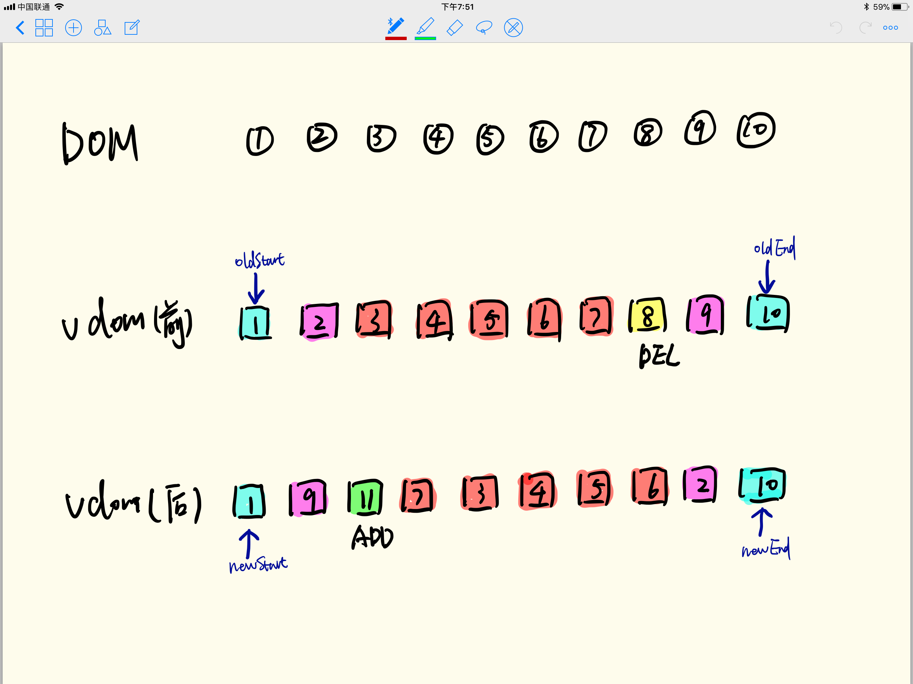
如上图的例子，更新前是1到10排列的`Node`列表，更新后是乱序排列的`Node`列表。罗列一下图中有以下几种类型的节点变化情况：
1. 头部相同、尾部相同的节点：如1、10
2. 头尾相同的节点：如2、9（处理完头部相同、尾部相同节点之后）
3. 新增的节点：11
4. 删除的节点：8
5. 其他节点：3、4、5、6、7

上图例子中设置了`oldStart+oldEnd`，`newStart+newEnd`这样2对指针，分别对应`oldVDOM`和`newVDOM`的起点和终点。`Vue`不断对`vnode`进行处理同时移动指针直到其中任意一对起点和终点相遇。处理过的节点`Vue`会在`oldVDOM`和`newVDOM`中同时将它标记为已处理（标记方法后文中有介绍）。`Vue`通过以下措施来提升`diff`的性能

##### 1. 优先处理特殊场景
- 头部的同类型节点、尾部的同类型节点。这类节点更新前后位置没有发生变化，所以不用移动它们对应的`DOM`
- 头尾/尾头的同类型节点。这类节点位置很明确，不需要再花心思查找，直接移动`DOM`就好

处理了这些场景之后，一方面一些不需要做移动的`DOM`得到快速处理，另一方面待处理节点变少，缩小了后续操作的处理范围，性能也得到提升。

##### 2. “原地复用”
“原地复用”是指`Vue`会尽可能复用`DOM`，尽可能不发生`DOM`的移动。`Vue`在判断更新前后指针是否指向同一个节点，其实不要求它们真实引用同一个`DOM`节点，实际上它仅判断指向的是否是同类节点（比如2个不同的`div`，在`DOM`上它们是不一样的，但是它们属于同类节点），如果是同类节点，那么`Vue`会直接复用`DOM`，这样的好处是不需要移动`DOM`。

**"原地复用"应该就是设置key和不设置key的区别：**

不设`key`，`newCh`和`oldCh`只会进行头尾两端的相互比较，设`key`后，除了头尾两端的比较外，还会从用`key`生成的对象`oldKeyToIdx`中查找匹配的节点，所以为节点设置`key`可以更高效的利用`DOM`。

#### 按步骤解析`updateChildren`过程
1. **处理头部的同类型节点，即`oldStart`和`newStart`指向同类节点的情况，如下图中的节点1**

这种情况下，将节点1的变更更新到`DOM`，然后对其进行标记，标记方法是`oldStart`和`newStart`后移1位即可，过程中不需要移动`DOM`（更新`DOM`或许是要的，比如属性变更了，文本内容变更了等等）
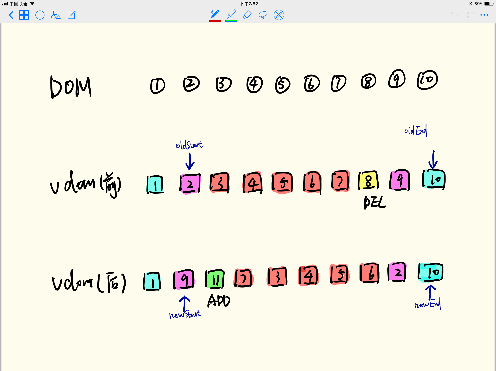

2. **处理尾部的同类型节点，即oldEnd和`newEnd`指向同类节点的情况，如下图中的节点10**

与情况（1）类似，这种情况下，将节点10的变更更新到`DOM`，然后oldEnd和`newEnd`前移1位进行标记，同样也不需要移动`DOM`
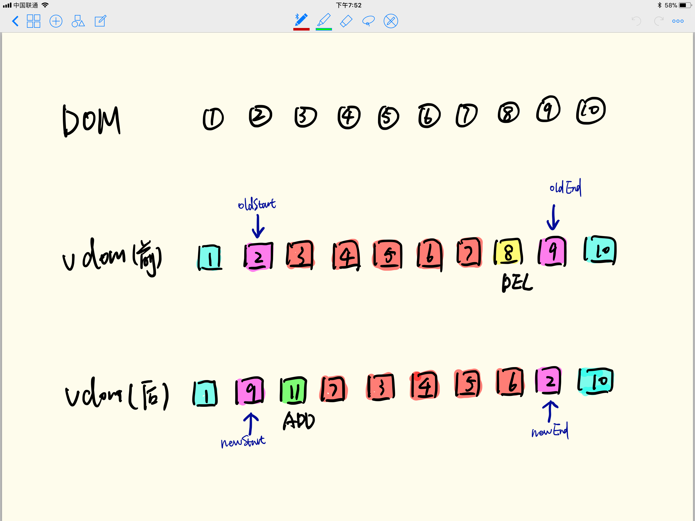

3. **处理头尾/尾头的同类型节点，即`oldStart`和`newEnd`，以及oldEnd和`newStart`指向同类节点的情况，如下图中的节点2和节点9**

先看节点2，其实是往后移了，移到哪里？移到oldEnd指向的节点（即节点9）后面，移动之后标记该节点，将`oldStart`后移1位，`newEnd`前移一位
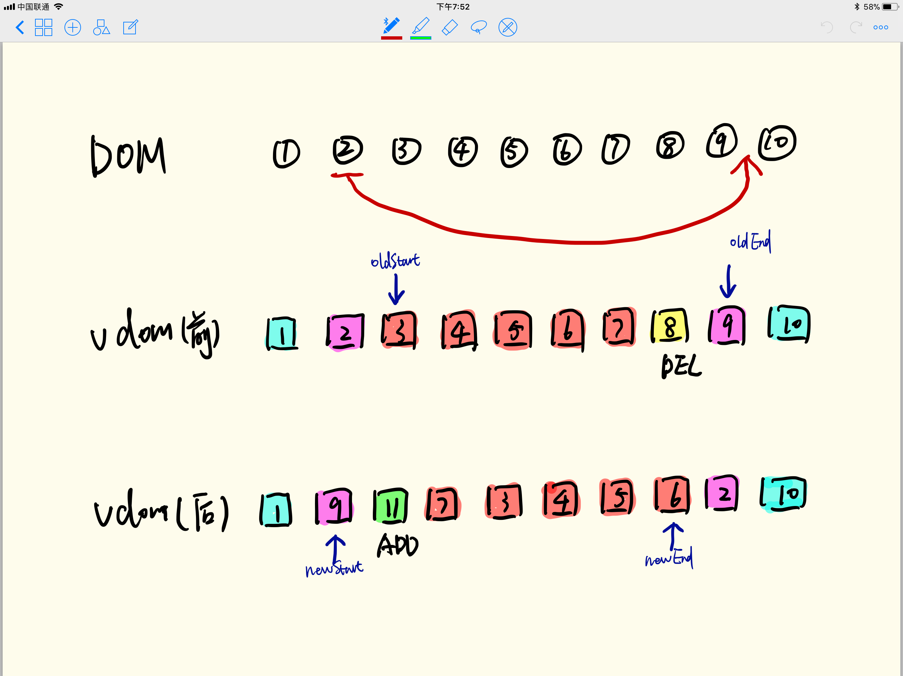

操作结束之后情况如下图
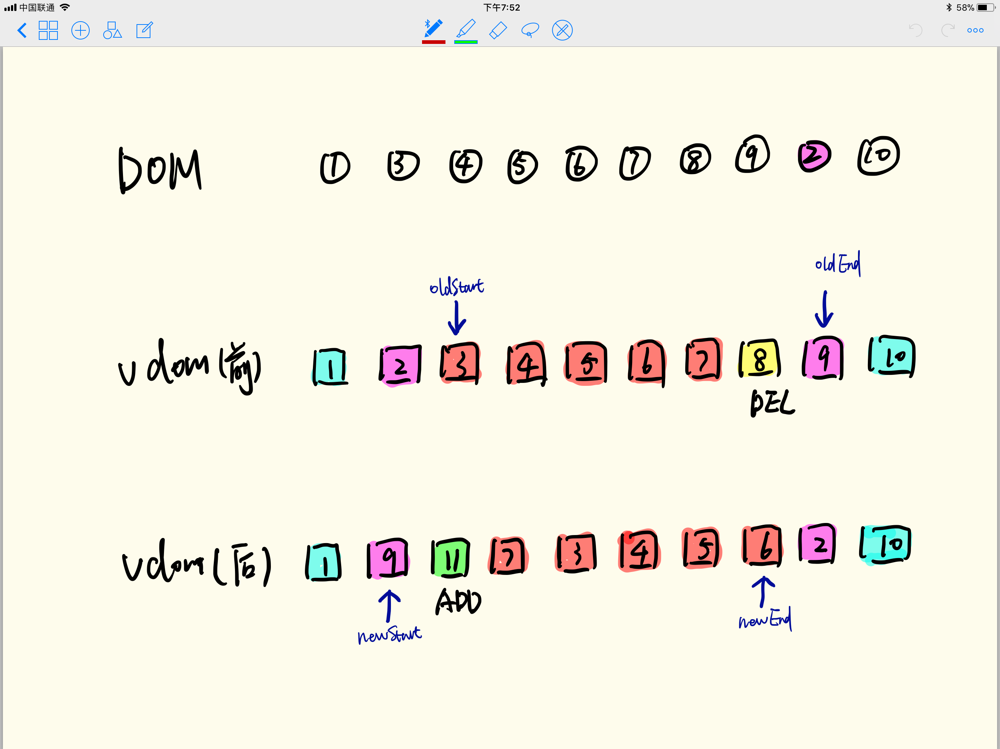

同样地，节点9也是类似的处理，处理完之后成了下面这样
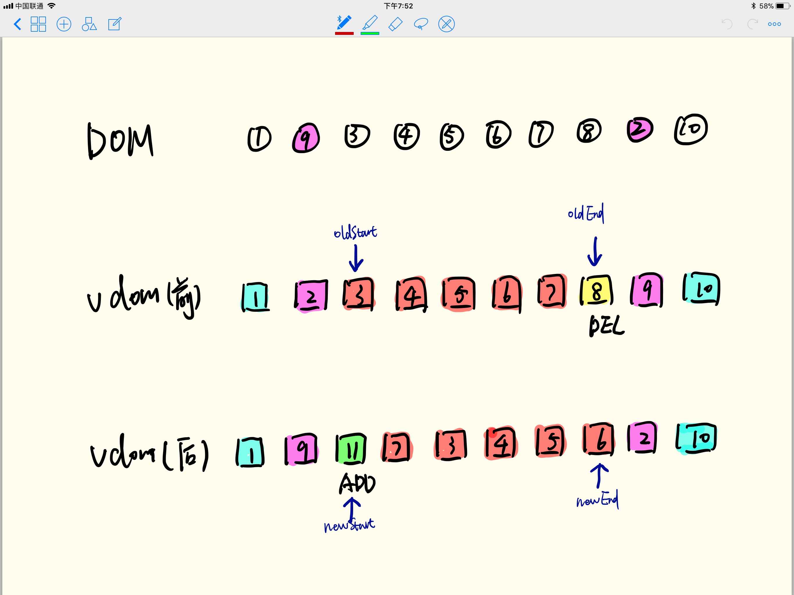

4. **处理新增的节点**

`newStart`来到了节点11的位置，在`oldVDOM`中找不到节点11，说明它是新增的
那么就创建一个新的节点，插入`DOM`树，插到什么位置？插到`oldStart`指向的节点（即节点3）前面，然后将`newStart`后移1位标记为已处理（注意`oldVDOM`中没有节点11，所以标记过程中它的指针不需要移动），处理之后如下图
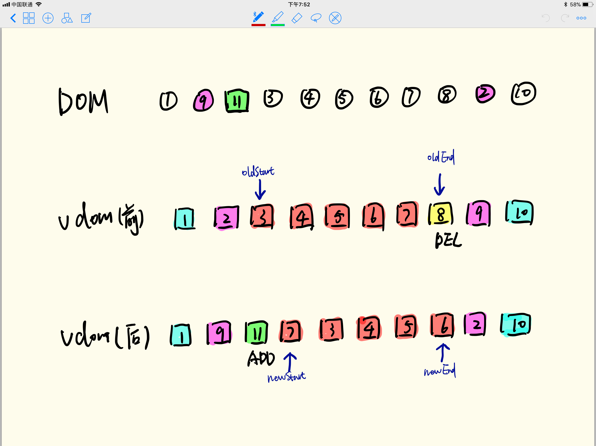

5. **处理更新的节点**

经过第（4）步之后，`newStart`来到了节点7的位置，在`oldVDOM`中能找到它而且不在指针位置（查找`oldVDOM`中`oldStart`到`oldEnd`区间内的节点），说明它的位置移动了

那么需要在`DOM`树中移动它，移到哪里？移到`oldStart`指向的节点（即节点3）前面，与此同时将节点标记为已处理，跟前面几种情况有点不同，`newVDOM`中该节点在指针处，可以移动`newStart`进行标记，而在`oldVDOM`中该节点不在指针处，所以采用设置为`undefined`的方式来标记（一定要标记吗？后面会提到）
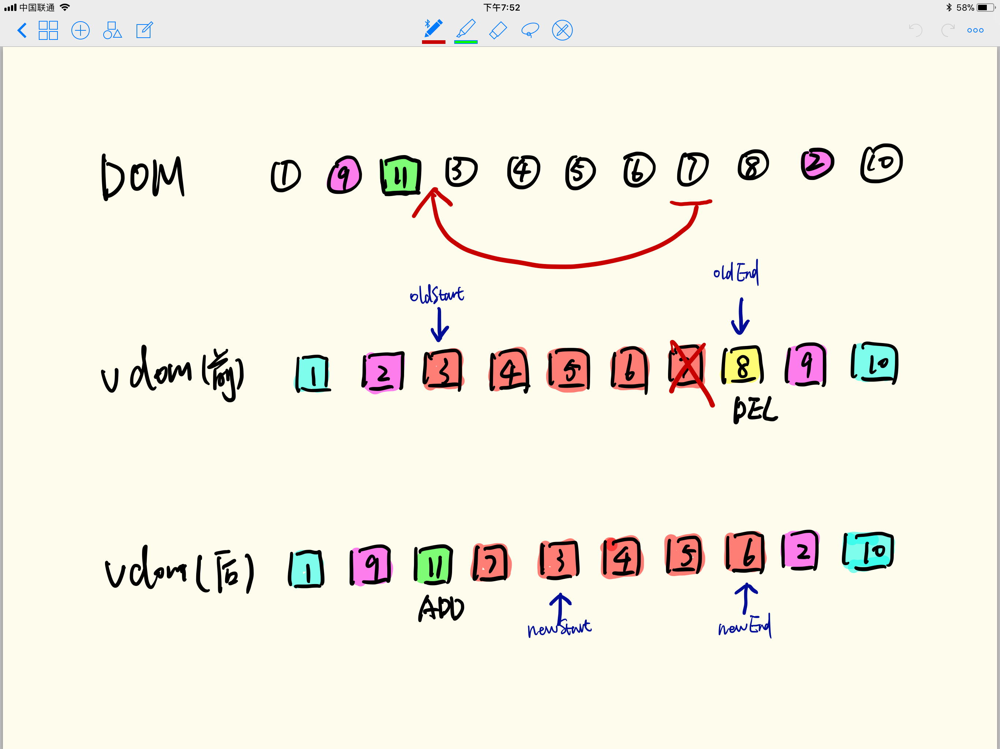

处理之后就成了下面这样
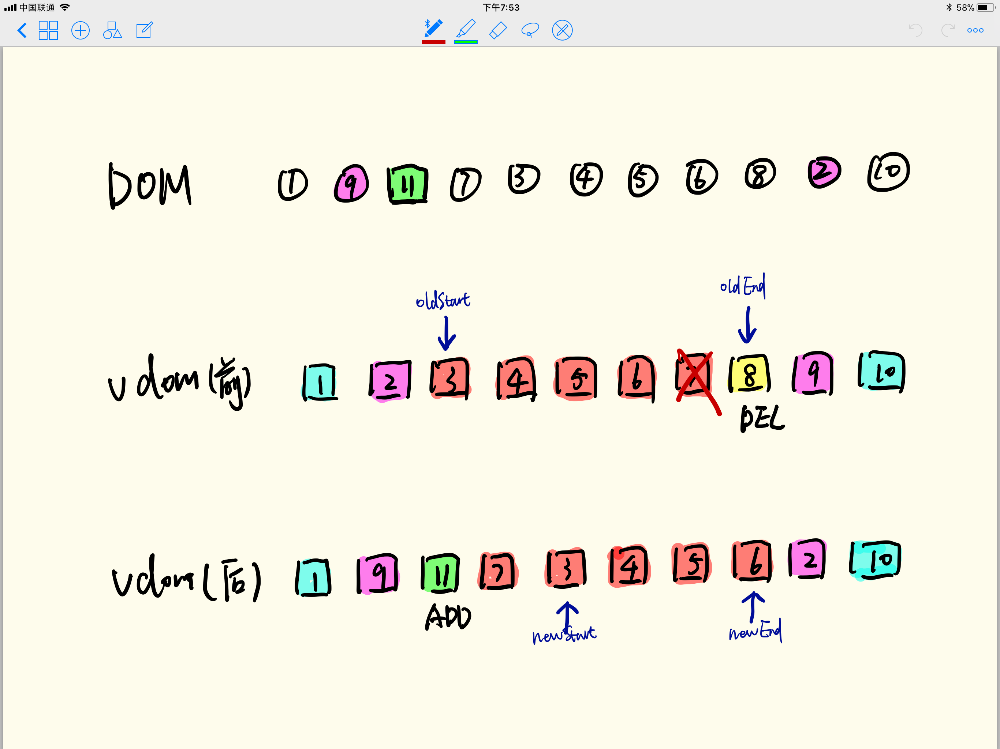

6. **处理3、4、5、6节点**

经过第（5）步处理之后，我们看到了令人欣慰的一幕，`newStart`和`oldStart`又指向了同一个节点（即都指向节点3），很简单，按照（1）中的做法只需移动指针即可，非常高效，3、4、5、6都如此处理，处理完之后如下图
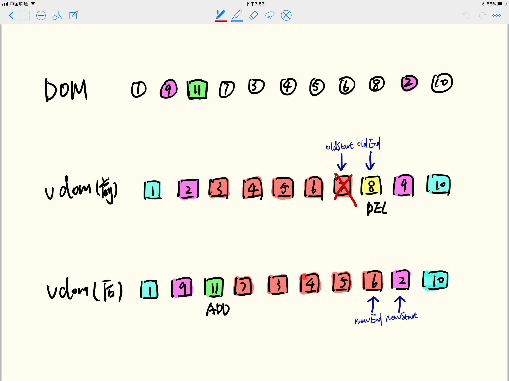

7. **处理需删除的节点**

经过前6步处理之后（实际上前6步是循环进行的），朋友们看`newStart`跨过了`newEnd`，它们相遇啦！而这个时候，`oldStart`和`oldEnd`还没有相遇，说明这2个指针之间的节点（包括它们指向的节点，即上图中的节点7、节点8）是此次更新中被删掉的节点。

OK，那我们在`DOM`树中将它们删除，再回到前面我们对节点7做了标记，为什么标记是必需的？标记的目的是告诉`Vue`它已经处理过了，是需要出现在新`DOM`中的节点，不要删除它，所以在这里只需删除节点8。

在应用中也可能会遇到`oldVDOM`的起止点相遇了，但是`newVDOM`的起止点没有相遇的情况，这个时候需要对`newVDOM`中的未处理节点进行处理，这类节点属于更新中被加入的节点，需要将他们插入到`DOM`树中。
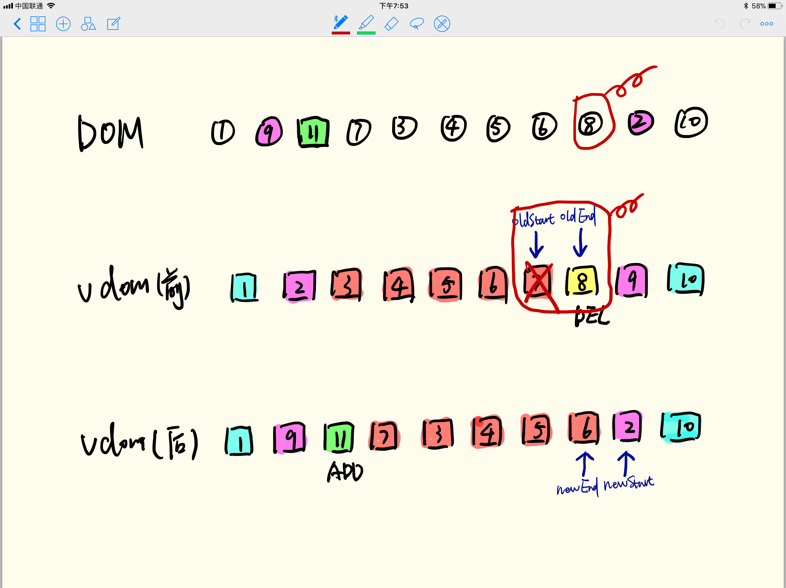

至此，整个`diff`过程结束了!

### 结语
整个过程是逐步找到更新前后`vDOM`的差异，然后将差异反应到`DOM`树上（也就是`patch`），特别要提一下`Vue`的`patch`是即时的，并不是打包所有修改最后一起操作`DOM`（React则是将更新放入队列后集中处理），朋友们会问这样做性能很差吧？实际上现代浏览器对这样的`DOM`操作做了优化，并无差别。